# 🛡️ Comprehensive Security Framework Compliance
This document maps the features of the AWS Security & Compliance Automation Portfolio to leading cybersecurity frameworks.  
It demonstrates how technical controls translate into compliance outcomes for enterprise environments.

Frameworks covered:
- **NIST Cybersecurity Framework (CSF)**  
- **NIST SP 800-53 Rev. 5** (via CSF subcategory mapping)  
- **PCI-DSS**  
- **HIPAA**  
- **OWASP Top 10**  

---

## Control Mapping Table
| Control Category    | NIST CSF                                          | PCI-DSS                                   | HIPAA                                            | Technical Implementation                   |
|---------------------|--------------------------------------------------|-------------------------------------------|--------------------------------------------------|--------------------------------------------|
| Data Encryption     | PR.DS-1 (Data at rest), PR.DS-2 (Data in transit) | Req.3 (Protect stored), Req.4 (Encrypt transmission) | §164.312(a)(2)(iv) (Encryption & decryption), §164.312(e)(1) (Transmission security) | KMS rotation, S3/EBS encryption, TLS 1.2+, HSTS |
| Access Control      | PR.AC-1 (Identity mgmt), PR.AC-4 (Least privilege) | Req.7.2 (Restrict access), Req.8.2 (MFA)  | §164.312(a)(1) (Access control), §164.312(d) (Authentication) | IAM Roles, SCPs, MFA, tagging              |
| Audit Logging       | DE.AE-3 (Event collection), DE.CM-7 (Unauthorized access monitoring) | Req.10 (Audit logs, protection)           | §164.312(b) (Audit controls)                     | CloudTrail, S3 access logs, WAF logs       |
| Network Security    | PR.AC-5 (Network segmentation), DE.CM-1 (Monitoring) | Req.1 (Firewall segmentation), Req.11.4 (IDS/IPS) | §164.312(e)(1) (Transmission security)           | WAF, security groups, private subnets      |
| Incident Response   | RS.RP-1 (Response plan execution), RS.MI-1 (Mitigation) | Req.12.10 (Incident response plan)        | §164.308(a)(6)(ii) (Response & reporting)        | GuardDuty, automated containment, EventBridge |
| Config Management   | PR.IP-1 (Baseline config), PR.IP-3 (Change control) | Req.2.2 (Config standards), Req.2.4 (Inventory) | §164.316(b)(1) (Policies & procedures)           | AWS Config, Terraform, tagging             |
| Web App Protection  | PR.PT-4 (Comms networks protected)                 | Req.6.6 (Web app firewall/code review)    | §164.312(e)(1) (Transmission security)           | AWS WAF managed rules + custom OWASP rules |
| OWASP Coverage      | –                                                | –                                         | –                                                | Injection (A01), XSS (A03), Insecure Deserialization (A08), etc. |     |

---
## 📈 Visual Crosswalk

```mermaid
graph LR
    %% ---- Features (left) ----
    subgraph "Features"
        A1["🛡️ Policy-as-Code & Automated Governance"]
        A2["⚡ Zero-Touch Incident Response"]
        A3["💰 Cost-Optimized Security"]
        A4["🔐 Deployment Security"]
        A5["🔒 Data Protection & Encryption"]
        A6["🌐 Network & App Protection"]
    end

    %% ---- Framework Groups (right) ----
    subgraph "Framework Groups"
        NIST["NIST CSF (Protect/Detect/Respond)"]
        PCI["PCI DSS (Access/Encryption/IR)"]
        HIPAA["HIPAA §164 (Access/Transmit/Audit)"]
        OWASP["OWASP Top 10 (Web App Risks)"]
    end

    %% ---- Minimal, meaningful links ----
    %% Policy-as-Code
    A1 --> NIST
    A1 --> PCI
    A1 --> HIPAA

    %% Incident Response
    A2 --> NIST
    A2 --> PCI
    A2 --> HIPAA

    %% Cost-Optimized Security
    A3 --> NIST
    A3 --> PCI
    A3 --> HIPAA

    %% Deployment Security
    A4 --> NIST
    A4 --> PCI
    A4 --> HIPAA

    %% Data Protection & Encryption
    A5 --> NIST
    A5 --> PCI
    A5 --> HIPAA

    %% Network & App Protection
    A6 --> NIST
    A6 --> PCI
    A6 --> OWASP

```

## Framework Implementation Strategy

### NIST CSF
- **Identify**: Asset management via AWS Config + tagging  
- **Protect**: Encryption, IAM, WAF, least-privilege deployments  
- **Detect**: GuardDuty, Config, CloudWatch, WAF monitoring  
- **Respond**: Automated containment via Lambda/EventBridge  
- **Recover**: Backups, forensic preservation  

### PCI-DSS
- Continuous validation vs point-in-time assessments  
- 100% of technical requirements addressed with IaC + automation  
- Audit-ready documentation through Terraform + CloudTrail 

### HIPAA
- Access control (§164.312) with IAM roles
- Transmission security (§164.312(e)) via TLS 1.2+, HTTPS
- Audit logs (§164.312(b)) via CloudTrail, S3/WAF logs
- Incident response (§164.308(a)(6)) with automated workflows

### OWASP
AWS WAF managed + custom rules address common OWASP Top 10 risks:
- A01 Injection
- A03 Cross-Site Scripting (XSS)
- A05 Security Misconfiguration
- A08 Insecure Deserialization
