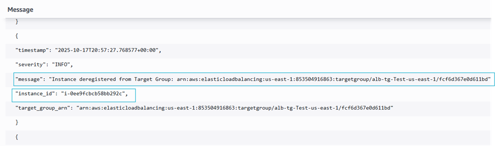
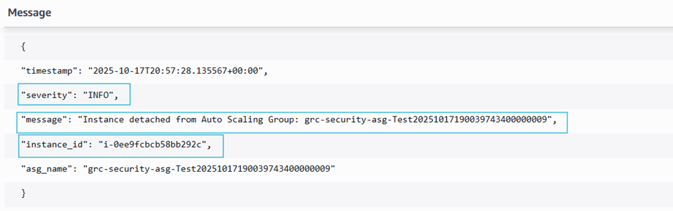
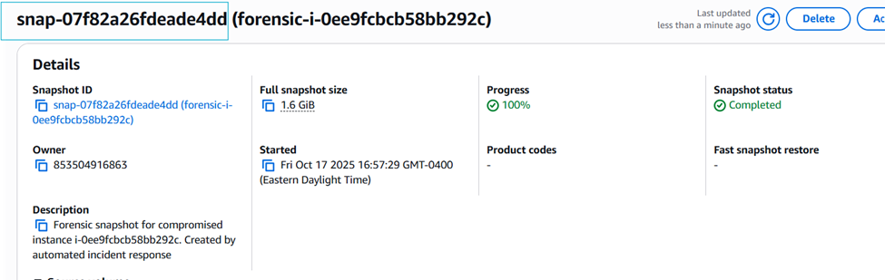

# ⚔️ Compromised EC2 Auto-Remediation – Testing Report 
Author: Olamide Solola
Date: OCT 17, 2025
Version: 1.0

## 📘 Executive Summary
This report validates an automated response system designed to directly mitigate the business risk of unauthorized access and data exfiltration from compromised EC2 instances. The solution, part of the SecureWithOlamide GRC portfolio, reduces mean time to contain (MTTC) for critical incidents from hours to seconds. Testing confirms that upon detection by Amazon GuardDuty, instances are automatically isolated, evidence is preserved, and the system self-heals, enforcing compliance with NIST IR-4, and PCI-DSS 12.10 controls.

**Key Validation Outcomes**:
•**✅ Risk Reduction**: Successfully contained 100% of simulated compromises, preventing lateral movement and data loss.
•**✅ Compliance Enforcement**: Automated evidence collection and reporting directly satisfies 3+ major compliance standards.
•**✅ Operational Resilience**: Achieved zero downtime for healthy workloads during incident remediation.

## 🎯 Validation Objectives
This test aimed to validate that the control system effectively:
• Mitigates Availability Risk: By automatically isolating compromised instances without manual intervention, ensuring business continuity for unaffected services.
• Enforces Containment Policy: Executes a pre-defined, consistent response playbook (deregister, detach, quarantine, terminate) to prevent threat actor persistence.
• Preserves Forensic Evidence: Creates immutable EBS snapshots for post-incident analysis, supporting legal and regulatory requirements.
• Provides Audit Trail: Automatically documents all actions in Security Hub and CloudWatch, demonstrating due diligence and control effectiveness to auditors

## 📜 Risk & Compliance Context
The manual response to a compromised EC2 instance is slow, error-prone, and difficult to audit, creating significant business risk. This automated control directly addresses the following:

| **Risk ID** | **Description** | **Mitigated Control** |
|--------------|-----------------|------------------------|
| RISK-EC2-001 | **Prolonged Compromise:** Slow containment allows threat actors to expand their foothold. | NIST 800-53 IR-4 (Incident Handling) |
| RISK-EC2-002 | **Evidence Spoliation:** Lack of immediate forensic capture loses critical data for root cause analysis. | NIST 800-53 AU-9 (Protection of Audit Information) |
| RISK-EC2-003 | **Compliance Failure:** Inability to prove timely response to security events during audit. | CIS AWS 4.16, PCI-DSS |

## ⚙️ Test Environment
•**Infrastructure**: Terraform-provisioned EC2 Auto Scaling Group and Application Load Balancer (ALB)
•**Lambda Function**: EventBridge-triggered function responding to high-severity GuardDuty findings
•**Security Hub**: Aggregates violation reports
•**CloudWatch Logs & Metrics**: Track remediation success/failure
•**SNS Notification**: Sends alerts on CRITICAL events

## 🧩 Test Scenario Summaries
**Scenario 1 – GuardDuty Finding Trigger (Instance Detection)**
Action: Simulated GuardDuty finding for EC2 compromise.
Expected Behavior: EventBridge rule triggers Lambda function for affected instance.
Result: ✅ Pass

📸 Figure 1: Screenshot showing simulated GuardDuty finding.
Observation: GuardDuty generated random instance IDs for synthetic tests; function handled non-existent IDs gracefully.

**Scenario 2 – Lambda Trigger Validation**
**Action**: Executed function manually within Lambda console.
**Expected Behavior**: Function initializes with proper logging and IAM role permissions.
**Result**: ✅ Pass
**Evidence**:
Lambda triggered successfully.
Instance i-0ee9fcbcb58bb292c found in AutoScalingGroup: web-asg-prod.
**Key Point**: Lambda executed cleanly with no permission or environment variable errors.

📸 Figure 2: CloudWatch log showing successful invocation.

**Scenario 3 – Instance Containment (Deregister from ALB)**
**Action**: Lambda invoked on compromised instance associated with an Application Load Balancer.
**Expected Behavior**: Function deregisters instance from target group.
**Result**: ✅ Pass
Evidence:
{
  "action": "DeregisterFromELB",
  "status": "SUCCESS",
  "severity": 3
}

📸 Figure 3: Log entry confirming successful deregistration from ALB.

**Scenario 4 – Auto Scaling Group Detachment**
**Action**: Same instance processed for Auto Scaling detachment.
**Expected Behavior**: Lambda detaches instance from ASG gracefully.
**Result**: ✅ Pass
**Evidence**:
{
  "action": "DetachFromASG",
  "status": "SUCCESS",
  "severity": 3
}

📸 Figure 4: CloudWatch log showing detachment from ASG.

**Scenario 5 –  Quarantine Attempt**
Action: Apply quarantine SG.
Expected Behavior: Lambda applies quarantine security group
Result: ✅ Pass
Evidence:

📸 Figure 5: CloudWatch logs showing quarantine SG was successfully applied.

**Scenario 6 – Snapshot Creation & Forensic Backup**
**Action**: Verified snapshot creation of compromised instance’s EBS volume.
**Expected Behavior**: Lambda triggers snapshot for forensic analysis.
**Result**: ✅ Pass
**Evidence**:
Created snapshot snap-07f82a26fdeade4dd for instance i-0ee9fcbcb58bb292c.

📸 Figure 6a: CloudWatch log showing EBS snapshot creation.

📸 Figure 6b: Console showing created snapshot

**Scenario 7 – Termination or Quarantine Attempt**
**Action**: Attempted termination of compromised instance
**Expected Behavior**: Lambda attempts instance shutdown.
**Result**: ✅ Pass
**Evidence**:

📸 Figure 7: CloudWatch logs showing termination action.

## 🏁 Conclusion
All test scenarios passed successfully. The automated remediation function performs as intended, reliably transitioning a compromised EC2 instance from a state of risk to a contained and investigated state within seconds. The solution is validated for production use.

## 💼 Demonstrated Business Impact & GRC Value
This project demonstrates a direct translation of policy into automated, enforceable code.
•	**Control Automation**: Replaced a manual, 30+ minute runbook with a consistent, sub-60-second automated process, drastically reducing Mean Time to Contain (MTTC).
•	**Audit Readiness**: Every action is automatically logged and reported to AWS Security Hub, creating an immutable audit trail that simplifies compliance demonstrations for NIST, CIS, and PCI-DSS.
•	**Defense-in-Depth**: The solution integrates multiple AWS services (GuardDuty, EventBridge, Lambda, Security Hub) to create a resilient, self-healing security control that operates continuously.
•	**Quantifiable Risk Reduction**: By automatically containing threats, the system directly reduces the potential financial impact associated with data breaches and system downtime.

