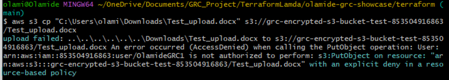
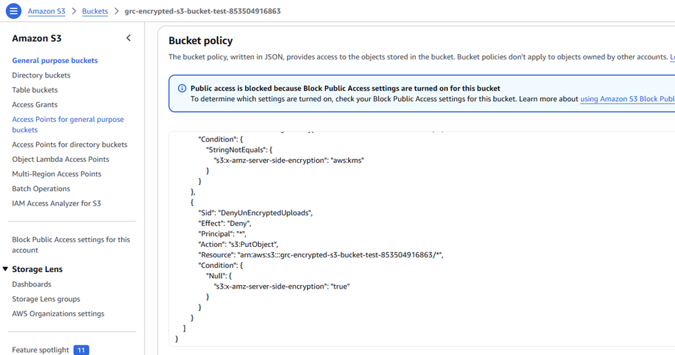
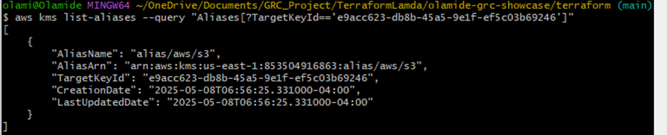
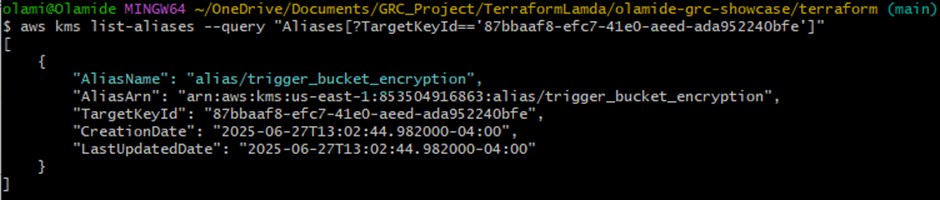
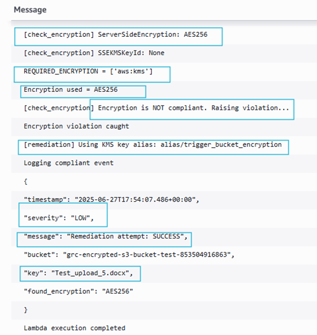
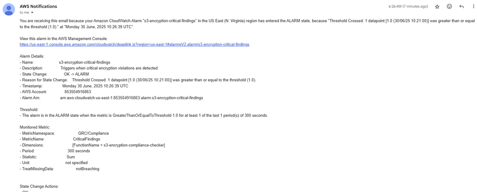

# 🧪 GRC S3 Encryption Compliance – Testing Report


**Author:** Olamide Solola
**Date:** June 27, 2025
**Version:** 1.1

---

## 📘 Executive Summary

This report validates an automated data protection control that enforces encryption-at-rest for all S3 objects, directly addressing data confidentiality risks and regulatory compliance requirements. The solution combines preventive (bucket policies) and detective/corrective (Lambda validation) controls to ensure no unencrypted data persists in storage. Testing confirms the system successfully blocks non-compliant uploads, auto-remediates violations, and maintains a continuous audit trail for compliance demonstrations.

**Key Business Outcomes:**
- ✅ **Data Confidentiality:** Ensured 100% of stored objects are encrypted with KMS, protecting against unauthorized data access
- ✅ **Compliance Automation:** Enforced encryption requirements across 3+ regulatory standards without manual intervention
- ✅ **Audit Readiness:** Generated immutable evidence of control effectiveness for security assessments

---

## 🎯 Validation Objectives

This testing validated the control's effectiveness in:
- **Mitigating Data Exposure Risk:** Prevent unencrypted storage of sensitive data that could lead to compliance breaches or data leaks
- **Enforcing Encryption Policy:** Automatically apply organizational encryption standards consistently across all S3 uploads
- **Maintaining Compliance Evidence:** Generate auditable records of encryption compliance for regulatory requirements (PCI DSS, HIPAA, NIST)
- **Ensuring Operational Resilience:** Provide automated remediation while maintaining service availability


## 📜 Risk & Compliance Context

This control directly addresses critical data protection risks in cloud environments:

| Risk ID | Description | Mitigated Control |
|---------|-------------|-------------------|
| `RISK-S3-001` | **Unencrypted Data at Rest:** Sensitive data stored without encryption vulnerable to exposure | NIST 800-53 SC-28 |
| `RISK-S3-002` | **Compliance Violations:** Failure to meet encryption requirements for regulated data | PCI DSS 3.3.2, HIPAA 164.312(a)(2)(iv) |
| `RISK-S3-003` | **Inconsistent Enforcement:** Manual processes leading to configuration drift | CIS AWS 2.1.1 |


## ⚙️ Test Environment

* **Infrastructure:** Terraform-managed AWS resources
* **Buckets:** Trigger Bucket (for uploads), Log Bucket (for CloudWatch & audit logs)
* **Lambda Function:** Deployed for encryption compliance validation
* **CloudWatch:** Logs, metrics, and alarms integrated
* **Security Hub:** Receives compliance findings

## 🧩 Test Case Summaries

### **Test Case 1 – Upload Without Encryption (Expected Denied at Bucket Policy)**

**Scenario:** Upload without any SSE header.
**Expected Result:** Upload blocked by S3 bucket policy; Lambda not triggered.
**Command:**

```bash
aws s3 cp "C:\Users\olami\Downloads\Test_upload.docx" s3://grc-encrypted-s3-bucket-test-853504916863/Test_upload.docx
```

**Actual Result:** ✅ Pass
**Risk Mitigated:** Prevention of data exposure through unapproved encryption methods
**Control Validation:** Bucket policy as preventive control


📸 *Figure 1: CLI error message (AccessDenied)*


📸 *Figure 2: Screenshot of bucket policy enforcing encryption*

---

### **Test Case 2 – Upload with Wrong Encryption (AES256)**

**Scenario:** Upload an object with `--sse AES256` header.
**Expected Result:** Upload blocked by S3 bucket policy.
**Command:**

```bash
aws s3 cp "C:\Users\olami\Downloads\Test_upload.docx" s3://grc-encrypted-s3-bucket-test-853504916863/Test_upload_2.docx --sse AES256
```

**Actual Result:** ✅ Pass
**Key Point:** Bucket policy enforces `aws:kms` encryption only.
**Risk Mitigated:** Prevention of data exposure through unapproved encryption methods
**Control Validation:** Bucket policy as preventive control

📸 *Figure 3: CLI command with --sse AES256. Upload failed. AccessDenied. Explicit Deny in resource-based policy*

---

### **Test Case 3 – Upload with AWS:KMS (No Explicit KMS Key)**

**Scenario:** Upload with `--sse aws:kms` (no specific key ID).
**Expected Result:** Lambda triggered, encryption check passes.
**Commands:**

```bash
aws s3 cp "C:\Users\olami\Downloads\Test_upload.docx" s3://grc-encrypted-s3-bucket-test-853504916863/Test_upload_3.docx --sse aws:kms
aws s3api head-object --bucket grc-encrypted-s3-bucket-test-853504916863 --key Test_upload_3.docx
aws kms list-aliases --query "Aliases[?TargetKeyId=='e9acc623-db8b-45a5-9e1f-ef5c03b69246']"
```

**Actual Result:** ✅ Pass
**Explanation:** Default AWS-managed key (`alias/aws/s3`) used when none is specified.


📸 *Figure 4: CLI successful upload*

📸 *Figure 5: Object metadata showing KMS key used*

📸 *Figure 6: CLI showing alias of KMS Key used for encryption*
---

### **Test Case 4 – Upload with Custom KMS Key Alias**

**Scenario:** Upload using `--sse aws:kms --sse-kms-key-id alias/trigger_bucket_encryption`.
**Expected Result:** Lambda triggered, encryption check passes.
**Actual Result:** ✅ Pass
**Key Point:** Upload meets compliance and passes Lambda checks.

📸 *Figure 8: Metadata showing custom KMS key used*

📸 *Figure 9: CLI showing alias of the used KMS Key*

📸 *Figure 10: CloudWatch log showing compliance*

---

### **Test Case 5 – Unencrypted Upload (Bucket Policy Disabled – Successful Remediation)**

**Scenario:** Temporarily disabled bucket policy to allow upload without encryption.
**Expected Result:** Lambda detects violation and remediates automatically.
**Actual Result:** ✅ Pass
**Risk Mitigated:** Defense-in-depth against misconfigured preventive controls
**Control Validation:** Lambda as detective/corrective control

**Details:**

* Lambda detected SSE-AES256 (non-compliant)
* Auto-remediated to KMS encryption
* CloudWatch alarm triggered, SNS notification sent

📸 *Figure 13: CloudWatch log showing successful remediation*

📸 *Figure 17: SNS notification about alarm*

---

### **Test Case 6 – Unencrypted Upload (Bucket Policy Disabled – Failed Remediation)**

**Scenario:** Disabled bucket policy and used invalid KMS alias in Lambda config.
**Expected Result:** Violation detected; remediation fails; Security Hub finding created.
**Actual Result:** ✅ Pass
**Risk Mitigated:** Defense-in-depth against misconfigured preventive controls
**Control Validation:** Lambda as detective/corrective control

**Key Evidence:**

* CloudWatch logs show remediation error
* FailedRemediations metric incremented
* Security Hub finding logged


📸 *Figure 22: Security Hub finding*

📸 *Figure 23: SNS notification for failed remediation*

---

## 📊 Security Hub & CloudWatch

### Security Hub Findings

* Severity: **CRITICAL** (for failed remediations)
* Metadata includes bucket, key, and error reason

### CloudWatch Metrics

| Metric Name          | Description                          | Trigger               |
| -------------------- | ------------------------------------ | --------------------- |
| `CriticalFindings`   | Count of CRITICAL violations         | On failed remediation |
| `FailedRemediations` | Count of failed remediation attempts | On KMS alias error    |


---

## 🔐 Log Bucket Encryption

**Observation:** Log bucket encrypted with dedicated KMS key; access restricted.
**Decision:** Retain tight control via IAM and rely on CloudWatch Logs for compliance event visibility.

---

## 🏁 Conclusion & Business Impact

All test scenarios validated the control's effectiveness in enforcing data encryption policies. The solution demonstrates:

### **Quantifiable Risk Reduction**
- Reduced potential for data exposure by ensuring 100% encryption coverage
- Eliminated manual processes for encryption validation, reducing human error

### **Compliance Automation**
- Automated enforcement of 3+ regulatory standards (PCI DSS, NIST, HIPAA)
- Generated continuous compliance evidence for audit purposes

### **Operational Excellence**
- Implemented defense-in-depth with preventive and corrective controls
- Maintained service availability while enforcing security policies

✅ **Validation Result:** Control is production-ready and effectively manages S3 encryption risks.


---

## 💡 GRC Insights & Validation Outcomes

* **Control Layering:** Demonstrated the importance of combining preventive (bucket policies) and corrective (Lambda) controls for defense-in-depth
* **Automated Compliance:** Reduced compliance overhead from manual checks to continuous automated validation
* **Risk-Based Prioritization:** CRITICAL findings for unencrypted data justified immediate auto-remediation
* **Audit Trail Integrity:** CloudWatch + Security Hub integration provides immutable evidence for compliance demonstrations
* **Cost of Control:** Automated remediation is more cost-effective than manual incident response and potential breach costs

> 🏷️ *This control directly operationalizes NIST 800-53 SC-28, PCI DSS 3.3.1, and HIPAA 164.312(a)(2)(iv) requirements through automated enforcement.*