# Threat Modeling - S3 Encryption Compliance & EC2 Auto-Remediation Project (GRC)

## 🛡️ STRIDE | 🔒 Encryption | ⚡ Auto-Remediation | 📜 Compliance

---

## 📑 Table of Contents
- [Executive Summary](#executive-summary)  
- [Assets & Trust Boundaries](#assets--trust-boundaries)  
- [Key Achievements & Impact](#key-achievements--impact)  
- [System Overview](#system-overview)  
- [Threat Modeling Using STRIDE](#threat-modeling-using-stride)  
- [EC2 Compromise Auto-Remediation](#new-ec2-compromise-auto-remediation)  
- [Certificate Management Threats](#certificate-management-threats)  
- [Threat-to-Control Mapping Matrix](#threat-to-control-mapping-matrix)  
- [Risk Prioritization](#risk-prioritization)  
- [Risk Heatmap (Visual)](#risk-heatmap-visual)  
- [Enhanced Control Classification](#enhanced-control-classification)  
- [Skills & Competencies Demonstrated](#skills--competencies-demonstrated)  
- [Assumptions & Future Enhancements](#assumptions--future-enhancements)  
- [Visuals](#visuals)  
  - [STRIDE → Mitigations Crosswalk](#-stride--mitigations-crosswalk)  
  - [EC2 Compromise Auto-Remediation Flow](#-ec2-compromise-auto-remediation-flow)  

---

## Executive Summary
This document outlines the threat model for a comprehensive, cloud-native Governance, Risk, and Compliance (GRC) solution built on AWS.  
The project addresses critical business risks of **data exposure**, **regulatory non-compliance**, and **instance compromise** by automatically enforcing encryption, tagging, access policies, and security remediation across **S3 storage** and **EC2 infrastructure**.

Using the **STRIDE methodology**, cloud-specific threats—including spoofed events, privilege escalation, data tampering, and instance compromise were identified and mitigated through a **defense-in-depth** strategy combining preventive, detective, and corrective controls.  

The implemented architecture not only secures data and compute resources but also demonstrates concrete alignment with **PCI-DSS**, **NIST 800-53**, **HIPAA**, and the **AWS Well-Architected Security Pillar**.  
This model showcases my ability to **translate complex GRC requirements into automated technical controls** across AWS services, ensuring security and compliance are inherent to enterprise cloud infrastructure.

---

## Assets & Trust Boundaries

**Assets:**
- S3 buckets (sensitive data at rest)  
- EC2 instances (compute workloads)  
- KMS keys (encryption & key rotation)  
- IAM roles and instance profiles (identity & access control)  
- ACM certificates (TLS/SSL termination)

**Trust Boundaries:**
- **AWS Account boundary** – governed by Org SCPs  
- **VPC boundary** – isolates workloads and controls traffic  
- **IAM boundary** – ensures least privilege separation of duties  
- **Service integration boundary** – managed via EventBridge, Lambda, and Security Hub  

---

## Key Achievements & Impact
- **Proactive Risk Reduction:** Shifted security left via S3 Bucket Policies and Organizational SCPs, preventing violations at deployment.
- **Automated Incident Response:** Zero-touch remediation for compromised EC2 instances, reducing MTTR from hours to minutes.
- **Operational Efficiency:** Automated remediation of unencrypted objects and non-compliant instances, ensuring continuous compliance.
- **Enhanced Visibility:** Centralized compliance monitoring via AWS Security Hub, Config, and CloudWatch.
- **Framework Compliance Acceleration:** Directly mapped controls to NIST, PCI-DSS, HIPAA, and AWS Well-Architected Framework for streamlined audits.

---

## System Overview

### Core Compliance Monitoring
1. **S3 Bucket Encryption Compliance Monitoring** – Ensures all uploads are encrypted with SSE-KMS.  
2. **KMS Key Rotation Monitoring** – Tracks adherence to rotation best practices.  
3. **ACM Certificate Expiry Monitoring** – Prevents service disruption by monitoring expiration.  
4. **Security Hub Integration** – Centralized reporting of critical/high violations.  

### Automated Response System
5. **EC2 Instance Auto-Remediation** – Isolates & terminates compromised instances.  
6. **Auto Scaling Group Integration** – Ensures healthy replacement instances.  
7. **SNS Notifications for Critical Alerts** – Real-time security alerting.  

### Governance & Monitoring
8. **CloudWatch Metrics and Alarms** – Publishes compliance metrics for dashboards.  
9. **AWS Config Rules** – Enforces mandatory tagging & config compliance.  
10. **Organization SCPs** – Prevents non-compliant resource creation at the org level.  

---

## Threat Modeling Using STRIDE

### Spoofing
**Threats:**
- Simulated S3 events triggering bogus Lambda executions  
- Unauthorized AWS principals invoking Lambda or submitting false Security Hub findings  
- Spoofed EC2 metadata  

**Mitigations:**
- Lambda resource policies restricting invocation to trusted sources  
- Strict IAM trust policies  
- Region/account validation for Security Hub submissions  
- IMDSv2 enforced on EC2 for metadata integrity  

---

### Tampering
**Threats:**
- Overwriting legitimate S3 uploads  
- Insider manipulation of CloudWatch logs  
- Tampered EC2 system files/logs  

**Mitigations:**
- S3 Versioning enabled  
- Mandatory SSE-KMS encryption  
- S3 bucket policies denying uploads without `aws:kms` header  
- IAM denies on mutable actions for non-admins  
- Restricted CloudWatch access  
- Security Hub-driven automated isolation & termination  
- Auto Scaling replacement of terminated instances  

---

### Repudiation
**Threats:**
- Users denying unencrypted uploads or disputing remediation  
- Audit gaps reducing investigation effectiveness  
- Security team disputes over remediation actions  

**Mitigations:**
- CloudWatch Logs for full compliance event context  
- Immutable Security Hub records  
- S3 Access Logging enabled  
- Detailed structured logs for compliance & remediation actions  
- VPC Flow Logs for forensic retention  

---

### Information Disclosure
**Threats:**
- Sensitive logs exposing metadata/object paths  
- Unencrypted S3 objects  
- Overly permissive IAM roles  
- Compromised EC2 instances leaking sensitive data  

**Mitigations:**
- Data classification tags enforced with Config + SCPs  
- Mandatory encryption via bucket policies  
- Least privilege IAM enforcement  
- Strict KMS key policies + rotation  
- Immediate isolation of compromised instances  
- Minimal-permission IAM instance profiles  
- TLS cert rotation to prevent SSL/TLS bypass  

---

### Denial of Service
**Threats:**
- Excessive uploads overwhelming Lambda/API  
- Log/alert spam causing costs or alert fatigue  
- Mass EC2 compromise triggering cascading remediation  

**Mitigations:**
- Lambda timeouts configured  
- AWS SDK retries for API errors  
- S3 lifecycle rules for cost control  
- Circuit-breaker logic for remediation workflows  
- CloudWatch alarms for remediation rates  
- Auto Scaling with sufficient capacity  

---

### Elevation of Privilege
**Threats:**
- Over-permissive IAM roles for Lambda or EC2  
- IAM misconfigurations enabling lateral movement  

**Mitigations:**
- IAM roles scoped to least privilege  
- SCPs deny high-risk IAM actions (e.g., `iam:PassRole`)  
- Strict KMS key policies  
- Deny sensitive EC2/IAM actions in instance profiles  
- Auto-revocation of compromised credentials via termination  
- Config rules to detect overly permissive IAM  

---

## EC2 Compromise Auto-Remediation

**Detection Sources:**
- AWS Security Hub findings (e.g., unprotected ports)  
- AWS Config compliance violations  
- Custom CloudWatch anomaly metrics  

**Response Flow:**
1. **Immediate Isolation** – quarantine SG + NACL blocks  
2. **Forensic Preservation** – VPC Flow Logs + metadata snapshot  
3. **Termination & Replacement** – instance termination + ASG replacement  

---

## Certificate Management Threats
**Threats:**
- Expired SSL/TLS certs causing outages  
- Misconfigured certificates  
- Unauthorized cert issuance  

**Mitigations:**
- Automated expiry monitoring (30, 14, 7 days)  
- DNS/email-based certificate validation  
- Automatic certificate renewal configured  
- EventBridge integration for cert state notifications  

---

## Threat-to-Control Mapping Matrix

| STRIDE Category | Example Threat | Mapped Mitigation(s) |
|-----------------|----------------|-----------------------|
| **Spoofing** | Fake S3 PutObject event | Lambda resource policy (M1), IAM trust policies, Security Hub validation |
| **Tampering** | Alter CloudWatch logs | IAM deny mutable actions, restricted log access, versioned storage |
| **Repudiation** | Dispute EC2 remediation | CloudWatch structured logs, Security Hub immutable records |
| **Information Disclosure** | Unencrypted S3 object | Bucket policy requiring SSE-KMS, SCPs enforcing encryption |
| **Denial of Service** | Excessive Lambda invokes | Lambda timeouts, retry/circuit breaker, scaling policies |
| **Elevation of Privilege** | Over-permissive EC2 role | SCP deny risky IAM actions, least privilege IAM profiles |

---

## Risk Prioritization

| Risk ID | Description                  | Severity | Likelihood | Mitigation Effectiveness | Residual Risk |
|---------|------------------------------|----------|------------|--------------------------|---------------|
| R1      | Unencrypted data upload      | High     | Medium     | High                     | Low           |
| R2      | Compromised EC2 instance     | Critical | Medium     | High                     | Low           |
| R3      | False compliance reporting   | High     | Low        | Medium                   | Medium        |
| R4      | SSL/TLS certificate expiry   | High     | Medium     | High                     | Low           |
| R5      | Lambda timeout failures      | Medium   | Medium     | Medium                   | Medium        |
| R6      | KMS key rotation disabled    | Medium   | Low        | High                     | Low           |

---

## Risk Heatmap (Visual)

```mermaid
graph LR
%% ---- Colors / styles ----
classDef low fill:#dff6e0,stroke:#2e7d32,stroke-width:1px;
classDef med fill:#fff4cc,stroke:#b26a00,stroke-width:1px;
classDef high fill:#ffd6cc,stroke:#c62828,stroke-width:1px;
classDef crit fill:#ffb3b3,stroke:#8b0000,stroke-width:2px;

%% ---- Columns = Likelihood ----
subgraph L1["Likelihood → Low"]
direction TB
C1["Impact: Low<br/><small>• R5: Minor config drift</small>"]:::low
C2["Impact: Medium<br/><small>• R6: Stale IAM user</small>"]:::med
C3["Impact: High<br/><small>&nbsp;</small>"]:::high
end

subgraph L2["Likelihood → Medium"]
direction TB
C4["Impact: Low<br/><small>&nbsp;</small>"]:::med
C5["Impact: Medium<br/><small>• R3: Public S3 bucket</small>"]:::high
C6["Impact: High<br/><small>• R2: EC2 compromise</small>"]:::crit
end

subgraph L3["Likelihood → High"]
direction TB
C7["Impact: Low<br/><small>&nbsp;</small>"]:::high
C8["Impact: Medium<br/><small>• R4: WAF misconfig</small>"]:::crit
C9["Impact: High<br/><small>• R1: Data exfiltration</small>"]:::crit
end

```

---

## Enhanced Control Classification

| Control                                     | Type       | Justification |
|---------------------------------------------|------------|---------------|
| S3 bucket policy denying unencrypted uploads | Preventive | Rejects non-compliant uploads before processing |
| EC2 isolation via SGs                        | Corrective | Contains compromised instances immediately |
| ASG replacement                             | Corrective | Maintains service availability |
| ACM certificate expiry monitoring            | Detective  | Prevents outages from expired certs |
| IAM deny mutable actions                     | Preventive | Prevents unauthorized changes |
| KMS key restrictions                         | Preventive | Restricts encryption key access |
| Lambda invocation restrictions               | Preventive | Only trusted services may invoke |
| CloudWatch structured logs                   | Detective  | Full audit trail of compliance events |
| Security Hub integration                     | Detective  | Centralized violation visibility |
| EC2 auto-remediation workflow                | Corrective | Automated compromise containment |

---
## Skills & Competencies Demonstrated
- **Cloud Security Architecture** – Multi-layered design using AWS native services  
- **Incident Response Automation** – Zero-touch EC2 remediation  
- **Threat Modeling & Risk Management** – STRIDE applied across AWS services  
- **Security Automation** – Automated preventive/detective/corrective controls  
- **GRC & Compliance Engineering** – Technical enforcement mapped to frameworks  
- **Enterprise-Scale Thinking** – Org-wide guardrails via SCPs & Config
- **AWS Well-Architected Alignment** – Controls mapped to the Security Pillar

---

## Visuals
### 📊 STRIDE → Mitigations Crosswalk

### ⚡ EC2 Compromise Auto-Remediation Flow

```mermaid
flowchart LR
  classDef step fill:#eef7ee,stroke:#2f7d32,stroke-width:1px,color:#233;
  classDef data fill:#eef2ff,stroke:#3b5bcc,stroke-width:1px,color:#233;
  classDef action fill:#fff7e6,stroke:#b36b00,stroke-width:1px,color:#233;

  A[Security Hub Finding]:::data --> B[EventBridge Rule\nroutes to Lambda]:::step
  B --> C[Remediation Lambda]:::step

  C --> D1[Immediate Isolation\n• Quarantine SG\n• NACL deny all]:::action
  C --> D2[Forensics\n• VPC Flow Logs\n• Metadata snapshot]:::action
  C --> D3[Terminate Instance]:::action

  D3 --> E[Auto Scaling Group\nlaunch replacement]:::step
  E --> F[Post-Actions\n• Security Hub update\n• SNS notify\n• CloudWatch log]:::data
```
