# 🏗️ Terraform Bootstrap — Secure Execution Role Setup

## 🎯 Purpose
Establishes the secure foundation for Infrastructure-as-Code by provisioning a least-privilege Terraform execution role. Ensures all infrastructure deployments occur under scoped permissions, eliminating over-privileged deployments.

## 🔐 What This Creates
- **Terraform Execution IAM Role** - Assumed by engineers
- **Least-Privilege Policies** - 200+ precisely scoped AWS permissions
- **Secure State Backend** - S3 + DynamoDB for state storage and locking
- **Role ARN Output** - Used by main infrastructure for assumed-role deployments

## ⚙️ How It Works

```mermaid
flowchart LR
    A[👤 Engineers] --> B[🔄 Assume Role]
    B --> C[👑 Terraform Execution Role]
    C --> D[🏗️ Deploy Infrastructure]
    C --> E[🔒 Scoped Permissions]
    C --> F[📁 Secure State]

```

## 🛡️ Security & Compliance

| **Control Area**   | **Standard**              | **Implementation**                  |
|:--------------------|:--------------------------|:------------------------------------|
| **Least Privilege** | NIST 800-53 AC-6          | 200+ scoped permissions             |
| **Role Separation** | CIS AWS 1.1               | Distinct deployment vs management roles |
| **State Protection**| NIST 800-53 CP-9          | Encrypted S3 + DynamoDB locking     |

## 🚀 Deployment
bash
cd bootstrap
terraform init
terraform plan -var="environment=Test"
terraform apply -var="environment=Test"

Output: terraform_execution_role_arn - Reference this in main Terraform configurations
